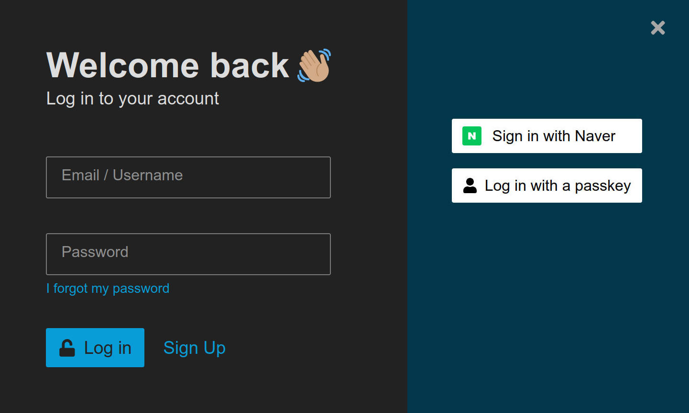

## Discourse Naver Login Auth
Login to Discourse using 'Sign in with Naver'

## Installation

1. Default(docker)   
   edit container/app.yml
``` dockerfile
hooks:
after_code:
- exec:
  cd: $home/plugins
  cmd:
- git clone https://github.com/centromics-forum/discourse-naver-auth.git
```

2. Used in source code

``` shell
$ cd $home/plugins
$ git clone https://github.com/centromics-forum/discourse-naver-auth.git
$ cd discourse-naver-auth
$ bundle install
```

## How to use
Go to Admin

Go to Plugins -> Naver Auth  And Enable And Click Settings 

Check "enable naver logins" And Fill "naver client id","naver secret" And Save


## Screenshots



## License

GPLv2
